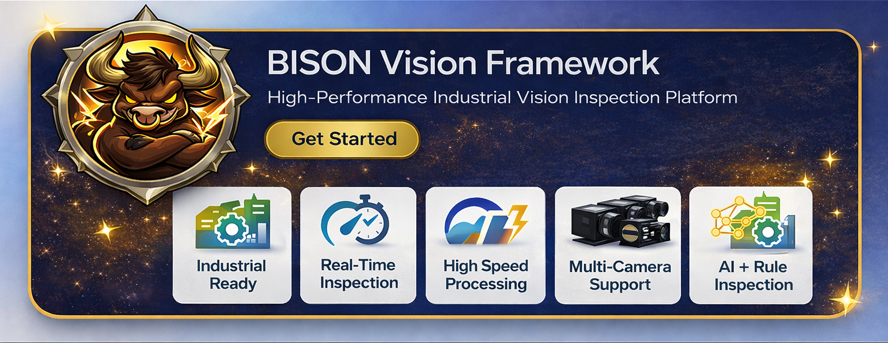
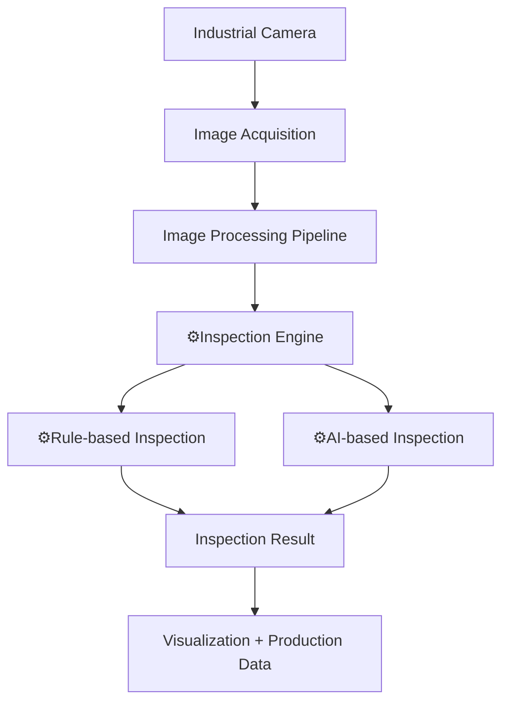
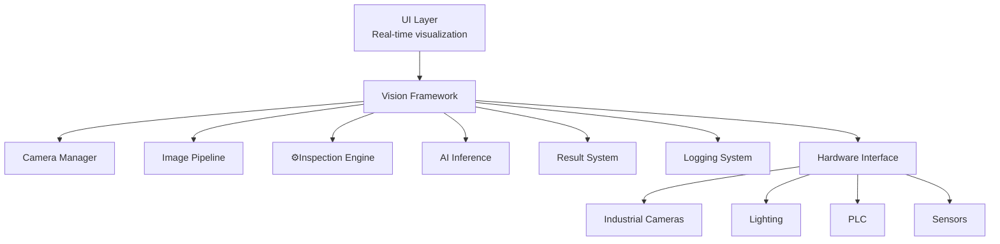
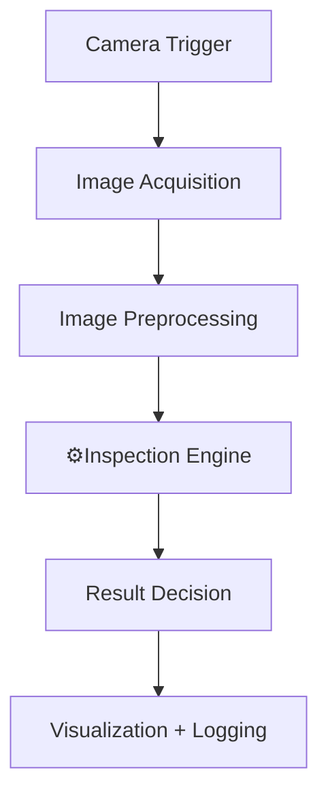

🇺🇸 <a href="README_eng.md">English</a> |
🇰🇷 <a href="README.md">한국어</a>

  

#  TITAN (BISON Vision Framework) 

산업용 머신비전 검사 플랫폼

BISON Vision Framework는 제조 환경에서 실시간 검사를 수행하기 위해
설계된 고성능 산업용 머신비전 플랫폼입니다.

이 시스템은 다음 기능을 하나의 통합된 모듈형 아키텍처로 제공합니다.

-   산업용 카메라 이미지 획득
-   AI 기반 검사
-   룰 기반 비전 검사
-   생산 데이터 분석 시스템

적용 환경

-   공장 자동화 시스템
-   스마트 제조 라인
-   AI 기반 품질 검사 시스템

------------------------------------------------------------------------

# 시스템 아키텍처

------------------------------------------------------------------------

# 핵심 모듈

## Camera Manager

산업용 카메라 제어 및 이미지 획득을 담당합니다.

주요 기능

-   GigE Vision 카메라 지원
-   하드웨어 트리거 동기화
-   멀티 카메라 동시 획득
-   고속 프레임 캡처
-   버퍼 관리

------------------------------------------------------------------------

## Image Processing Pipeline

실시간 프레임 처리 및 검사 흐름을 담당합니다.

Pipeline 단계

-   이미지 획득
-   이미지 전처리
-   ROI 추출
-   검사 처리
-   결과 생성

저지연 실시간 검사를 위해 최적화되어 있습니다.

------------------------------------------------------------------------

##  GAUR Inspection Engine

BISON Vision Framework의 핵심 검사 엔진입니다.

GAUR는 세계에서 가장 강력한 야생 소 중 하나인 **Gaur (Bos gaurus)**에서
이름을 가져왔습니다.

설계 철학

-   강력한 처리 성능
-   고속 검사 처리
-   산업 환경에서의 높은 안정성

------------------------------------------------------------------------

##  GAUR AI Inference Engine

딥러닝 기반 검사 기능을 제공합니다.

지원 기능

-   객체 검출 (Object Detection)
-   분류 (Classification)
-   세그멘테이션 (Segmentation)
-   이상 탐지 (Anomaly Detection)
-   OCR

고성능 추론을 위해 최적화된 백엔드를 사용할 수 있습니다.

예

-   TensorRT
-   Custom C++ Inference Runtime

------------------------------------------------------------------------

## Visualization UI

실시간 검사 시스템 모니터링 인터페이스입니다.

기능

-   실시간 카메라 화면 표시
-   검사 결과 Overlay
-   ROI 설정
-   생산 현황 모니터링
-   시스템 상태 표시

------------------------------------------------------------------------

## Production Logging System

검사 결과와 시스템 이벤트를 기록합니다.

기록 데이터

-   검사 결과
-   OK / NG 통계
-   Cycle Time
-   카메라 이벤트
-   시스템 로그

이를 통해 생산 이력 추적과 품질 분석이 가능합니다.

------------------------------------------------------------------------

## 소프트웨어 아키텍처

------------------------------------------------------------------------

# 성능 설계

고속 생산 라인을 위해 다음 기술을 사용합니다.

-   멀티스레드 처리
-   비동기 이미지 파이프라인
-   Ring Buffer 메모리 관리
-   병렬 검사 실행
-   Non‑Blocking UI 업데이트

------------------------------------------------------------------------

# 주요 머신비전 적용 사례

-   표면 결함 검사
-   조립 상태 검증
-   치수 측정
-   제품 분류
-   바코드 인식
-   유무 검사
------------------------------------------------------------------------

## 검사 워크플로우 예시

------------------------------------------------------------------------

# 지원 하드웨어

일반적인 시스템 구성

-   Industrial PC
-   Intel CPU
-   NVIDIA GPU (선택)
-   GigE Industrial Camera
-   Industrial Lighting
-   PLC Interface

------------------------------------------------------------------------

# 설계 철학

BISON Vision Framework는 다음 목표로 개발되었습니다.

-   산업 환경 안정성
-   실시간 처리 성능
-   모듈형 아키텍처
-   AI 기반 검사 확장성
-   멀티 카메라 확장성

------------------------------------------------------------------------

# Repository Scope

이 저장소는 Vision Framework 구조와 예제 컴포넌트를 제공합니다.

실제 상용 AI 모델 및 검사 알고리즘은 포함되어 있지 않습니다.

------------------------------------------------------------------------

# BISON AI Vision Lab

스마트 제조를 위한 산업용 AI 검사 기술
