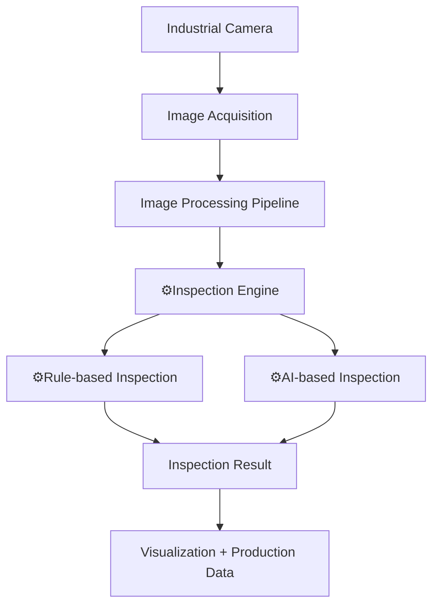
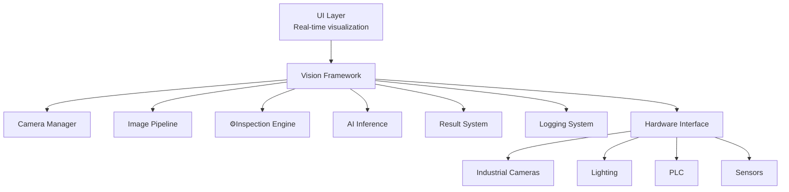
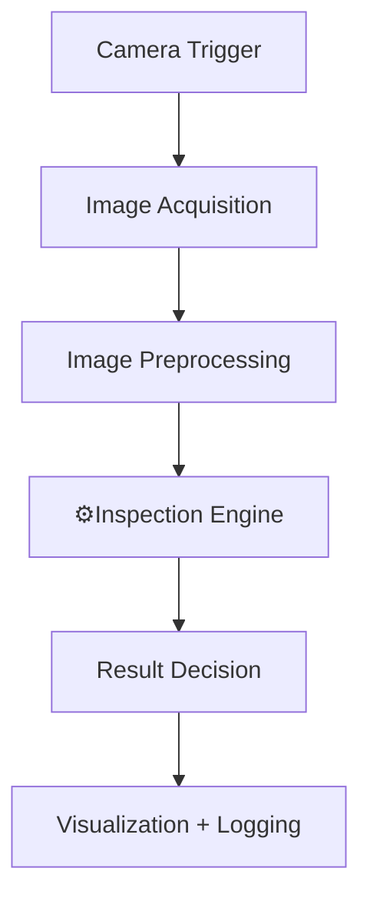

  

#  TITAN (BISON Vision Framework) 

Industrial Machine Vision Inspection Platform

🦬 BISON Vision Framework is a high-performance industrial machine vision platform designed for real-time inspection in manufacturing environments.

The system integrates industrial camera acquisition, AI-based inspection, rule-based vision tools, and production data analytics into a unified modular architecture.

It is designed for factory automation systems, smart manufacturing lines, and AI-driven quality inspection.

---

# System Architecture

---

# Core Modules

The framework is composed of modular subsystems designed for industrial inspection systems.

## Camera Manager

Responsible for controlling industrial cameras and image acquisition.

Features

- GigE Vision camera support
- hardware trigger synchronization
- multi-camera acquisition
- high-speed frame grabbing
- buffer management

---

## Image Processing Pipeline

Handles real-time frame processing and inspection workflow.

Pipeline stages

image grab
image preprocessing
ROI extraction
inspection processing
result generation

The pipeline is optimized for low latency real-time inspection.

---

##  GAUR Engine (BISON Inspection Engine)

The core inspection and AI inference engine used in the BISON Vision Framework is called **GAUR**.

GAUR is named after the **Gaur (Bos gaurus)**, one of the largest and most powerful wild cattle species in the world.

The name represents the design philosophy of the engine:

- powerful processing capability
- high-speed inference
- strong stability in industrial environments

Just like the gaur is known for its strength and speed, the GAUR engine is designed to deliver **fast and reliable inspection performance in real manufacturing environments**.

---

##  GAUR Inspection Engine

GAUR is the core inspection engine used in the BISON Vision Framework.

The engine integrates:

- rule-based vision inspection
- AI inference modules
- inspection result management

The engine is designed to support high-throughput inspection pipelines in industrial environments.

Key characteristics:

- high-speed inspection execution
- modular inspection architecture
- integration with AI inference modules
- scalable inspection pipeline

---

##  GAUR AI Inference Engine

The GAUR AI Inference Engine provides deep learning inference capabilities for industrial inspection systems.

Supported capabilities:

- object detection
- classification
- segmentation
- anomaly detection
- OCR

The engine is designed for high-performance inference using optimized backends such as TensorRT or custom C++ inference runtimes.

---

## Visualization UI

The operator interface provides real-time monitoring of inspection systems.

Capabilities

live camera display
inspection result overlay
ROI configuration
production monitoring
system status display

The UI is designed for factory operators and maintenance engineers.

---

## Production Logging System

All inspection results and system events are recorded for production analytics.

Logged data

inspection results
OK / NG statistics
cycle time
camera events
system logs

This enables traceability and quality monitoring.

---

## Software Architecture

---

# Performance Design

The framework is designed to operate in high-throughput production environments.

Key strategies

multi-thread processing
async image pipeline
ring buffer memory management
parallel inspection execution
non-blocking UI updates

These techniques allow the system to maintain stable inspection throughput.

---

# Typical Industrial Use Cases

The platform supports various machine vision inspection tasks.

Examples

surface defect inspection
assembly verification
dimension measurement
product classification
barcode detection
presence / absence detection

---

## Example Inspection Workflow

---

# Supported Hardware

Typical deployment configuration

industrial PC
Intel CPU
NVIDIA GPU (optional)
GigE industrial cameras
industrial lighting systems
PLC interface

---

# Design Principles

The system was developed based on the following design goals.

industrial reliability
real-time performance
modular architecture
AI-ready inspection
scalable camera integration

---

# Future Development

Planned extensions

distributed inspection architecture
cloud production analytics
self-learning inspection models

---

# Repository Scope

This repository provides the vision framework structure and example components.

Proprietary AI models and production inspection algorithms are not included.

---

# BISON AI Vision Lab

Industrial AI inspection technologies for smart manufacturing.
